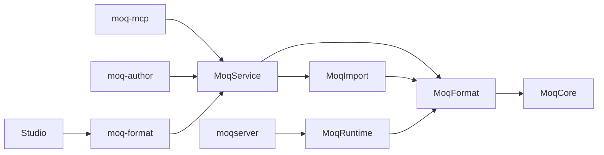

# Architecture Overview

## Products and boundaries

moqserver is a monorepo with two products:

- `server/`: a deterministic Swift/Vapor mock HTTP server and three authoring executables.
- `studio/`: a Kotlin/Compose desktop application for editing `.moqproj` bundles.

The shared document contract is [`format/schema.json`](format/schema.json). A bundle contains
`project.yml`, endpoint YAML documents in `endpoints/`, and response files in `fixtures/`.
Studio's Kotlin document models are generated from the schema. Swift owns parsing, import,
validation, fixture materialization, and persistence; Studio does not maintain another YAML writer
or validator.

## Swift modules

| Target | Responsibility |
|---|---|
| `MoqCore` | Domain models, naming, validation protocols, request/auth rules |
| `MoqFormat` | YAML loading/writing, validation, runtime conversion, transactional `ProjectStore` |
| `MoqImport` | OpenAPI/HAR parsing and deterministic import conversion |
| `MoqService` | Transport-neutral authoring sessions and operations |
| `MoqRuntime` | Vapor routing, authentication, variant selection, runtime state and admin API |
| `MoqCLI` / `Run` | `moqserver serve` and `validate` |
| `MoqMCP` / `MoqMCPRun` | MCP tools/resources over stdio (`moq-mcp`) |
| `MoqFormatServiceRun` | Content-Length-framed JSON-RPC over stdio (`moq-format`) |
| `MoqAuthorCLI` / `MoqAuthorRun` | One-shot JSON-input commands (`moq-author`) |

The HTTP server binary stays independent of the MCP SDK and OpenAPI import machinery.
Authoring tools do not call an LLM; Studio's optional AI providers live in `studio-ai`.
`server/MoqTestSupport` is a separate Apple-platform Swift package for downstream tests.

## Persistence and recovery

`ProjectStore` is an actor. Saves write a complete sibling staging bundle, verify structural
reloadability, check the loaded disk fingerprint, move the old bundle to a backup, and install the
staged bundle. Semantic completeness is separate: an unfinished endpoint may be saved but must
pass validation before serving.

A stable sibling advisory lock coordinates recovery and commits across cooperating processes.
Contention returns `E_PROJECT_BUSY`; callers retry after the other operation completes. The lock
file is deliberately retained so every process locks the same inode. Recovery never removes a
live cooperating writer's staging directory. A changed or externally deleted bundle causes
`E_PROJECT_CHANGED`. Arbitrary text editors do not participate in advisory locking; fingerprinting
detects their changes, but cannot make uncoordinated external writes transactional.

Recovery restores a sole backup if the destination is missing; multiple backups require manual
recovery. Do not describe the two directory moves as an atomic filesystem exchange: a reader that
does not take the lock can observe the brief gap. The server loads its project at startup; it does
not hot-reload authoring changes.

## Studio modules and workflows

| Module | Responsibility |
|---|---|
| `composeApp` | Desktop composition root, UI, file dialogs, runtime inspector and IO adapters |
| `studio-domain` | `StudioRootViewModel`, immutable workflow state, undo/redo, import review |
| `studio-project-format` | Generated models, format RPC client, supervised subprocess, repository adapter |
| `studio-data` | Settings, preferences and credentials |
| `studio-ai` | Optional AI provider integrations |
| `studio-ui`, `studio-design-system`, `studio-code-editor` | Shared UI, tokens and editing components |
| `studio-export` | Consumer reference exports |
| `studio-logging` | Logging infrastructure |

Open/save and import parsing call `moq-format`; live validation sends the current unsaved document
through a stateless RPC. The repository serializes load/save operations and retains the session
and loaded revision. Each process generation must pass the protocol-version/capability handshake.
After a restart, an unknown session is recreated only after its reopened revision matches the
original baseline. Writes with uncertain transport outcomes are not automatically replayed.

Save completion records the snapshot actually saved. Edits made while the save is in flight remain
dirty. Recovery actions are available in Tools: retry the format service or reload the project.
Save As preserves edits separately when resolving a disk conflict.

## Runtime request flow

Vapor matches method/path templates (`/users/{id}` becomes a parameterized route). GraphQL uses
operation-aware lookup. The handler validates auth and request rules, captures the call count and
runtime override, selects a variant, applies network simulation/delay, and returns response bytes.

`call_count` limits eligible variants before selection; `strict_call_count` rejects an uncovered
call number. Within eligible variants, selection uses:

1. `X-Mock-Variant`, then runtime override, then configuration override to select a named candidate.
2. Matching `request_match` constraints.
3. Accept negotiation when no named override was requested; a declared default wins equal quality.
4. Declared default, then declaration order. Unknown named variants retain the legacy default fallback.

Runtime scenarios are named collections of REST endpoint overrides. Activation validates all
entries and replaces overrides and counters in one actor operation. `X-Mock-Session` selects an
isolated state store with separate counters, overrides, scenarios and request history. Definitions
and sessions are process-local; clients can export/import scenario JSON via the admin API. Sessions
must be explicitly released. Limits are 64 sessions, 100 scenarios per store, and 500 recent requests
per store. Admin credentials also protect the new control and history routes.

See [runtime workflows](docs/RUNTIME_WORKFLOWS.md), [admin API](docs/ADMIN_API.md),
[authoring CLI](docs/AUTHORING_CLI.md), and [format contract](docs/FORMAT_IMPLEMENTATION.md).
